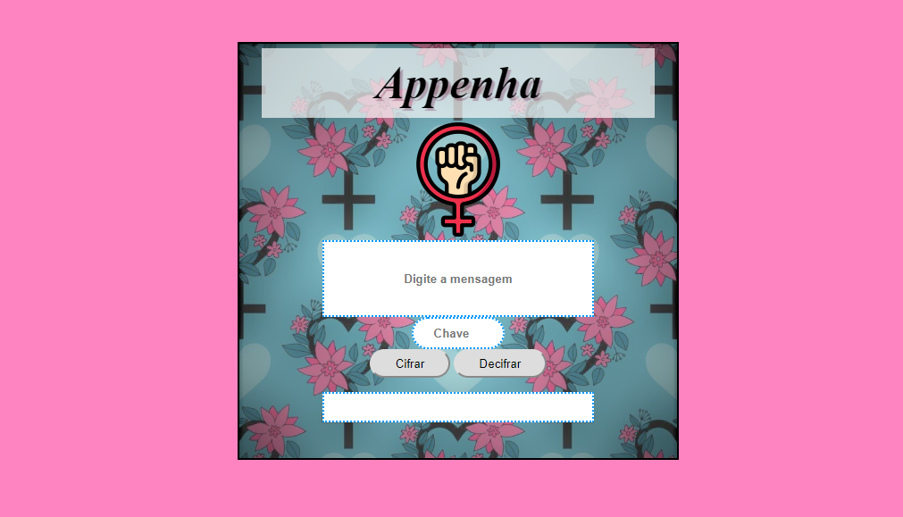

# Cifra de César

## Introdução

A [cifra de
César](https://pt.wikipedia.org/wiki/Cifra_de_C%C3%A9sar) é um dos primeiros
tipos de criptografias conhecidas na história.  
É um tipo de cifra por substituição, em que cada letra do texto original é
substituida por outra que se encontra há um número fixo de posições
(deslocamento) mais a frente do mesmo alfabeto.

## O projeto

Neste projeto, o usuário poderá cifrar e decrifrar um texto
indicando a chave de deslocamento.  
A interface permite ao usuário:

* Escolher a posição de deslocamento;
* Inserir uma mensagem para ser cifrada;
* Ver o resultado da mensagem cifrada;
* Inserir uma mensagem para ser decifrada;
* Ver o resultado da mensagem decifrada.

Para proporcionar essa experiência ao usuário foi utilizado:

* HTML  
1. Foram criados:    
-Caixa de texto utilizando textarea para colocar a mensagem a ser cifrada/decifrada;  
-Caixa para inserir a chave de deslocamento utilizando input;  
-Parágrafo para exibir o resultado da mensagem cifrada/decifrada.   
 2. Foram criados buttons para os botões cifrar e decifrar.
  
* CSS  
Utilizado para melhorar a estética do site.

* JavaScript  
1. Foram criadas as funções para cifrar e decifrar os textos;  
2. Imprime os resultados na tela.

## Definição do produto  

#### Appenha  

O aplicativo Appenha foi idealizado para mulheres vítimas de violência doméstica e familiar que estão em medida protetiva de distanciamento.   
Atualmente, resta à vítima, ou qualquer pessoa por ela indicada, levar o fato à delegacia.  
Muitas vezes não há tempo para a intervenção policial e o ofensor vem a praticar o crime de feminicídio. 

#### Como funciona

Assim que a vítima fizer um BO na delegacia ela recebe o endereço do site/app.  
Se o agressor desobedecer a medida protetiva, a vítima poderá enviar a mensagem cifrada alertando a polícia, que ao recebê-la poderá adotar de imediato as providências legais cabíveis, como enviar ajuda.  
O aplicativo irá facilitar a denúncia, em momento real sem ser necessário ir a delegacia para relatar a situação, evitando assim, muitos casos de feminícidio.  

